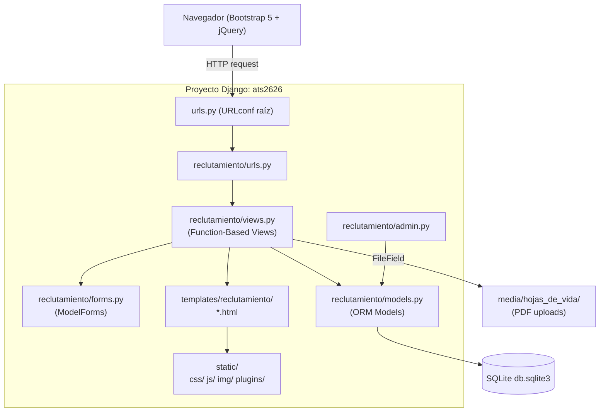
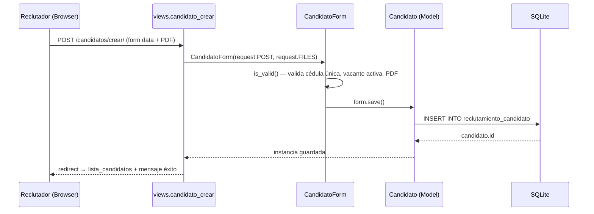
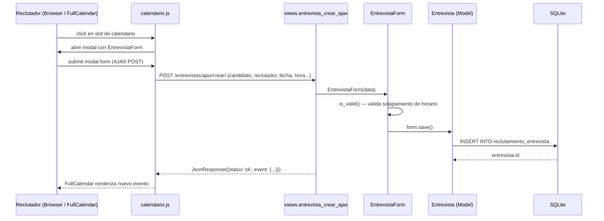

# Design Document: Sistema de Reclutamiento ATS (ats-recruitment-system)

## Overview

Sistema de Reclutamiento (ATS — Applicant Tracking System) completo construido con Django 6 MVT (Model-View-Template),
vistas basadas en funciones, Bootstrap 5, jQuery y SQLite. El sistema cubre el ciclo completo de reclutamiento:
publicación de vacantes, recepción de candidatos, pipeline de selección drag & drop, agenda de entrevistas con
FullCalendar, evaluaciones, emisión de ofertas laborales, reportes analíticos y un tour guiado de política de
contratación inclusiva con Driver.js.

El proyecto Django se denomina **ats2626** y la aplicación principal es **reclutamiento**.
No se usa Django REST Framework; toda la comunicación asíncrona (pipeline, calendario, calificación rápida) se
realiza mediante vistas Django que responden JSON a peticiones AJAX de jQuery.

---

## Architecture

### Diagrama general de componentes




### Estructura de directorios del proyecto

```
ats2626/                          ← raíz del proyecto
├── ats2626/                      ← configuración Django
│   ├── settings.py
│   ├── urls.py
│   ├── wsgi.py
│   └── asgi.py
├── reclutamiento/                ← app principal
│   ├── migrations/
│   ├── templates/
│   │   └── reclutamiento/
│   │       ├── base.html
│   │       ├── dashboard.html
│   │       ├── auth/
│   │       │   └── login.html
│   │       ├── reclutadores/
│   │       │   ├── lista.html
│   │       │   ├── form.html
│   │       │   └── detalle.html
│   │       ├── vacantes/
│   │       │   ├── lista.html
│   │       │   ├── form.html
│   │       │   └── detalle.html
│   │       ├── candidatos/
│   │       │   ├── lista.html
│   │       │   ├── form.html
│   │       │   └── detalle.html
│   │       ├── entrevistas/
│   │       │   ├── lista.html
│   │       │   └── form.html
│   │       ├── evaluaciones/
│   │       │   ├── lista.html
│   │       │   └── form.html
│   │       ├── ofertas/
│   │       │   ├── lista.html
│   │       │   └── form.html
│   │       ├── calendario.html
│   │       ├── pipeline.html
│   │       └── reportes.html
│   ├── static/
│   │   ├── css/
│   │   │   └── ats.css
│   │   ├── js/
│   │   │   ├── pipeline.js
│   │   │   ├── calendario.js
│   │   │   ├── hotkeys_rating.js
│   │   │   └── tour.js
│   │   ├── img/
│   │   └── plugins/
│   │       ├── fullcalendar/
│   │       ├── jquery-ui/
│   │       ├── hotkeys-js/
│   │       └── driver.js/
│   ├── admin.py
│   ├── apps.py
│   ├── forms.py
│   ├── models.py
│   ├── urls.py
│   └── views.py
├── media/
│   └── hojas_de_vida/
├── db.sqlite3
└── manage.py
```

---

## Sequence Diagrams

### Flujo: Registrar candidato y asignar a vacante



### Flujo: Pipeline drag & drop

```mermaid
sequenceDiagram
    participant U as Reclutador (Browser / jQuery UI)
    participant JS as pipeline.js
    participant V as views.pipeline_mover
    participant M as Candidato (Model)
    participant DB as SQLite

    U->>JS: drop candidato en columna nueva
    JS->>V: POST /pipeline/mover/ {candidato_id, nueva_etapa} (AJAX)
    V->>M: Candidato.objects.get(id=candidato_id)
    V->>M: candidato.etapa_actual = nueva_etapa; save()
    M->>DB: UPDATE reclutamiento_candidato SET etapa_actual=...
    DB-->>M: OK
    V-->>JS: JsonResponse({status:'ok', etapa: nueva_etapa})
    JS-->>U: actualiza UI (tarjeta en nueva columna)
```

### Flujo: Crear entrevista desde FullCalendar



### Flujo: Calificación rápida con Hotkeys-js

```mermaid
sequenceDiagram
    participant U as Reclutador (Browser)
    participant JS as hotkeys_rating.js
    participant V as views.evaluacion_calificar_rapido
    participant M as Evaluacion (Model)
    participant DB as SQLite

    U->>JS: presiona tecla 1-5 en vista evaluación
    JS->>V: POST /evaluaciones/calificar-rapido/ {evaluacion_id, puntuacion} (AJAX)
    V->>M: Evaluacion.objects.get(id=evaluacion_id)
    V->>M: evaluacion.puntuacion = puntuacion; save()
    M->>DB: UPDATE reclutamiento_evaluacion SET puntuacion=...
    V-->>JS: JsonResponse({status:'ok', puntuacion: X})
    JS-->>U: muestra badge con nueva puntuación
```

---

## Components and Interfaces

### Component 1: Models (reclutamiento/models.py)

**Purpose**: Definir el esquema de datos del ATS usando Django ORM. Cada modelo mapea a una tabla SQLite.

**Responsibilities**:
- Representar entidades del negocio: Reclutador, Vacante, Candidato, Entrevista, Evaluacion, Oferta
- Encapsular validaciones de campo y lógica de negocio básica (métodos `__str__`, `save` override, propiedades)
- Proveer choices para campos de estado, etapa y modalidad

```python
# ── Choices ──────────────────────────────────────────────────────────────────

class EstadoReclutador(models.TextChoices):
    ACTIVO   = 'activo',   'Activo'
    INACTIVO = 'inactivo', 'Inactivo'

class EstadoVacante(models.TextChoices):
    ABIERTA  = 'abierta',  'Abierta'
    CERRADA  = 'cerrada',  'Cerrada'
    PAUSADA  = 'pausada',  'Pausada'

class Modalidad(models.TextChoices):
    PRESENCIAL = 'presencial', 'Presencial'
    REMOTO     = 'remoto',     'Remoto'
    HIBRIDO    = 'hibrido',    'Híbrido'

class EtapaCandidato(models.TextChoices):
    POSTULADO   = 'postulado',   'Postulado'
    PRESELECCION= 'preseleccion','Preselección'
    ENTREVISTA  = 'entrevista',  'Entrevista'
    EVALUACION  = 'evaluacion',  'Evaluación'
    OFERTA      = 'oferta',      'Oferta'
    CONTRATADO  = 'contratado',  'Contratado'
    RECHAZADO   = 'rechazado',   'Rechazado'

class EstadoCandidato(models.TextChoices):
    ACTIVO   = 'activo',   'Activo'
    INACTIVO = 'inactivo', 'Inactivo'

class ModalidadEntrevista(models.TextChoices):
    PRESENCIAL = 'presencial', 'Presencial'
    VIRTUAL    = 'virtual',    'Virtual'
    TELEFONICA = 'telefonica', 'Telefónica'

class RecomendacionEvaluacion(models.TextChoices):
    CONTRATAR  = 'contratar',  'Contratar'
    RECHAZAR   = 'rechazar',   'Rechazar'
    EN_ESPERA  = 'en_espera',  'En Espera'

class EstadoOferta(models.TextChoices):
    PENDIENTE  = 'pendiente',  'Pendiente'
    ACEPTADA   = 'aceptada',   'Aceptada'
    RECHAZADA  = 'rechazada',  'Rechazada'
    VENCIDA    = 'vencida',    'Vencida'
```


### Component 2: Forms (reclutamiento/forms.py)

**Purpose**: Validar y sanitizar datos de entrada del usuario usando Django ModelForms.

**Responsibilities**:
- Proveer un ModelForm por cada entidad con widgets Bootstrap 5
- Ejecutar validaciones personalizadas (`clean_*`, `clean`)
- Manejar upload de archivos PDF para hoja de vida

```python
class ReclutadorForm(forms.ModelForm):
    class Meta:
        model = Reclutador
        fields = ['nombres','apellidos','correo','telefono','cargo','estado']

class VacanteForm(forms.ModelForm):
    class Meta:
        model = Vacante
        fields = ['titulo','descripcion','departamento','modalidad',
                  'salario','fecha_publicacion','fecha_cierre','estado','reclutador']

class CandidatoForm(forms.ModelForm):
    class Meta:
        model = Candidato
        fields = ['nombres','apellidos','cedula','correo','telefono',
                  'hoja_de_vida','etapa_actual','estado','vacante']
    # clean_cedula(): unicidad
    # clean_hoja_de_vida(): validar que sea PDF, max 5 MB

class EntrevistaForm(forms.ModelForm):
    class Meta:
        model = Entrevista
        fields = ['candidato','reclutador','fecha','hora_inicio','hora_fin',
                  'modalidad','observaciones']
    # clean(): validar hora_inicio < hora_fin, sin solapamiento por reclutador

class EvaluacionForm(forms.ModelForm):
    class Meta:
        model = Evaluacion
        fields = ['entrevista','puntuacion','comentario','recomendacion']
    # clean_puntuacion(): rango 1-5

class OfertaForm(forms.ModelForm):
    class Meta:
        model = Oferta
        fields = ['candidato','salario','cargo','fecha','estado','observaciones']
```

### Component 3: Views (reclutamiento/views.py)

**Purpose**: Manejar peticiones HTTP y responder con templates renderizados o JSON (para AJAX).

**Responsibilities**:
- Implementar CRUDs completos (listar con paginación/búsqueda, crear, editar, eliminar)
- Proveer vistas AJAX para pipeline, calendario y calificación rápida
- Calcular métricas para dashboard y reportes
- Proteger todas las vistas con `@login_required`

```python
# Patrón de vista lista (paginación + búsqueda)
@login_required
def lista_candidatos(request):
    q = request.GET.get('q', '')
    qs = Candidato.objects.filter(
        Q(nombres__icontains=q) | Q(apellidos__icontains=q) | Q(cedula__icontains=q)
    ).select_related('vacante').order_by('-id')
    paginator = Paginator(qs, 10)
    page = paginator.get_page(request.GET.get('page'))
    return render(request, 'reclutamiento/candidatos/lista.html',
                  {'page_obj': page, 'q': q})

# Patrón de vista crear/editar
@login_required
def candidato_crear(request):
    form = CandidatoForm(request.POST or None, request.FILES or None)
    if form.is_valid():
        form.save()
        messages.success(request, 'Candidato registrado correctamente.')
        return redirect('reclutamiento:lista_candidatos')
    return render(request, 'reclutamiento/candidatos/form.html', {'form': form})

# Vista AJAX pipeline
@login_required
@require_POST
def pipeline_mover(request):
    candidato_id = request.POST.get('candidato_id')
    nueva_etapa  = request.POST.get('nueva_etapa')
    try:
        c = Candidato.objects.get(pk=candidato_id)
        c.etapa_actual = nueva_etapa
        c.save(update_fields=['etapa_actual'])
        return JsonResponse({'status': 'ok', 'etapa': nueva_etapa})
    except Candidato.DoesNotExist:
        return JsonResponse({'status': 'error', 'msg': 'No encontrado'}, status=404)

# Vista AJAX calendario (listar eventos)
@login_required
def calendario_eventos(request):
    start = request.GET.get('start')
    end   = request.GET.get('end')
    qs = Entrevista.objects.filter(fecha__range=[start, end]).select_related('candidato','reclutador')
    events = [
        {'id': e.id,
         'title': f"{e.candidato} — {e.reclutador}",
         'start': f"{e.fecha}T{e.hora_inicio}",
         'end':   f"{e.fecha}T{e.hora_fin}",
         'color': '#0d6efd'}
        for e in qs
    ]
    return JsonResponse(events, safe=False)
```

### Component 4: URLs (reclutamiento/urls.py)

**Purpose**: Mapear rutas HTTP a vistas con nombres únicos para uso de `` en templates.

```python
app_name = 'reclutamiento'

urlpatterns = [
    # Auth
    path('login/',  views.login_view,  name='login'),
    path('logout/', views.logout_view, name='logout'),

    # Dashboard
    path('', views.dashboard, name='dashboard'),

    # Reclutadores CRUD
    path('reclutadores/',             views.lista_reclutadores,   name='lista_reclutadores'),
    path('reclutadores/crear/',       views.reclutador_crear,     name='reclutador_crear'),
    path('reclutadores/<int:pk>/editar/',  views.reclutador_editar, name='reclutador_editar'),
    path('reclutadores/<int:pk>/eliminar/',views.reclutador_eliminar,name='reclutador_eliminar'),

    # Vacantes CRUD
    path('vacantes/',                 views.lista_vacantes,       name='lista_vacantes'),
    path('vacantes/crear/',           views.vacante_crear,        name='vacante_crear'),
    path('vacantes/<int:pk>/editar/', views.vacante_editar,       name='vacante_editar'),
    path('vacantes/<int:pk>/eliminar/',views.vacante_eliminar,    name='vacante_eliminar'),
    path('vacantes/<int:pk>/',        views.vacante_detalle,      name='vacante_detalle'),

    # Candidatos CRUD
    path('candidatos/',               views.lista_candidatos,     name='lista_candidatos'),
    path('candidatos/crear/',         views.candidato_crear,      name='candidato_crear'),
    path('candidatos/<int:pk>/editar/',views.candidato_editar,    name='candidato_editar'),
    path('candidatos/<int:pk>/eliminar/',views.candidato_eliminar,name='candidato_eliminar'),
    path('candidatos/<int:pk>/',      views.candidato_detalle,    name='candidato_detalle'),

    # Entrevistas CRUD + AJAX
    path('entrevistas/',              views.lista_entrevistas,    name='lista_entrevistas'),
    path('entrevistas/crear/',        views.entrevista_crear,     name='entrevista_crear'),
    path('entrevistas/<int:pk>/editar/',views.entrevista_editar,  name='entrevista_editar'),
    path('entrevistas/<int:pk>/eliminar/',views.entrevista_eliminar,name='entrevista_eliminar'),
    path('entrevistas/ajax/crear/',   views.entrevista_crear_ajax,name='entrevista_crear_ajax'),
    path('entrevistas/ajax/<int:pk>/eliminar/',views.entrevista_eliminar_ajax,name='entrevista_eliminar_ajax'),

    # Evaluaciones CRUD + AJAX
    path('evaluaciones/',             views.lista_evaluaciones,   name='lista_evaluaciones'),
    path('evaluaciones/crear/',       views.evaluacion_crear,     name='evaluacion_crear'),
    path('evaluaciones/<int:pk>/editar/',views.evaluacion_editar, name='evaluacion_editar'),
    path('evaluaciones/<int:pk>/eliminar/',views.evaluacion_eliminar,name='evaluacion_eliminar'),
    path('evaluaciones/calificar-rapido/', views.evaluacion_calificar_rapido, name='evaluacion_calificar_rapido'),

    # Ofertas CRUD
    path('ofertas/',                  views.lista_ofertas,        name='lista_ofertas'),
    path('ofertas/crear/',            views.oferta_crear,         name='oferta_crear'),
    path('ofertas/<int:pk>/editar/',  views.oferta_editar,        name='oferta_editar'),
    path('ofertas/<int:pk>/eliminar/',views.oferta_eliminar,      name='oferta_eliminar'),

    # Pipeline
    path('pipeline/',                 views.pipeline,             name='pipeline'),
    path('pipeline/mover/',           views.pipeline_mover,       name='pipeline_mover'),

    # Calendario
    path('calendario/',               views.calendario,           name='calendario'),
    path('calendario/eventos/',       views.calendario_eventos,   name='calendario_eventos'),

    # Reportes
    path('reportes/',                 views.reportes,             name='reportes'),
    path('reportes/datos/',           views.reportes_datos,       name='reportes_datos'),
]
```

---

## Data Models

### Model 1: Reclutador

```python
class Reclutador(models.Model):
    nombres         = models.CharField(max_length=100)
    apellidos       = models.CharField(max_length=100)
    correo          = models.EmailField(unique=True)
    telefono        = models.CharField(max_length=20)
    cargo           = models.CharField(max_length=100)
    estado          = models.CharField(max_length=10, choices=EstadoReclutador.choices,
                                       default=EstadoReclutador.ACTIVO)
    fecha_registro  = models.DateField(auto_now_add=True)

    class Meta:
        ordering = ['apellidos', 'nombres']
        verbose_name_plural = 'Reclutadores'

    def __str__(self):
        return f"{self.nombres} {self.apellidos}"
```

**Validation Rules**:
- `correo`: único en la base de datos
- `telefono`: 7–20 caracteres, sólo dígitos y `+`
- `estado`: valor dentro de `EstadoReclutador.choices`


### Model 2: Vacante

```python
class Vacante(models.Model):
    titulo             = models.CharField(max_length=200)
    descripcion        = models.TextField()
    departamento       = models.CharField(max_length=100)
    modalidad          = models.CharField(max_length=15, choices=Modalidad.choices)
    salario            = models.DecimalField(max_digits=12, decimal_places=2, null=True, blank=True)
    fecha_publicacion  = models.DateField()
    fecha_cierre       = models.DateField(null=True, blank=True)
    estado             = models.CharField(max_length=10, choices=EstadoVacante.choices,
                                          default=EstadoVacante.ABIERTA)
    reclutador         = models.ForeignKey(Reclutador, on_delete=models.SET_NULL,
                                           null=True, related_name='vacantes')

    class Meta:
        ordering = ['-fecha_publicacion']

    def __str__(self):
        return f"{self.titulo} ({self.departamento})"

    @property
    def esta_activa(self):
        return self.estado == EstadoVacante.ABIERTA
```

**Validation Rules**:
- `fecha_cierre` >= `fecha_publicacion` si se provee
- `salario` >= 0 si se provee

### Model 3: Candidato

```python
def ruta_hoja_de_vida(instance, filename):
    return f"hojas_de_vida/{instance.cedula}/{filename}"

class Candidato(models.Model):
    nombres       = models.CharField(max_length=100)
    apellidos     = models.CharField(max_length=100)
    cedula        = models.CharField(max_length=20, unique=True)
    correo        = models.EmailField()
    telefono      = models.CharField(max_length=20)
    hoja_de_vida  = models.FileField(upload_to=ruta_hoja_de_vida, blank=True, null=True)
    etapa_actual  = models.CharField(max_length=15, choices=EtapaCandidato.choices,
                                     default=EtapaCandidato.POSTULADO)
    estado        = models.CharField(max_length=10, choices=EstadoCandidato.choices,
                                     default=EstadoCandidato.ACTIVO)
    vacante       = models.ForeignKey(Vacante, on_delete=models.SET_NULL,
                                      null=True, related_name='candidatos')
    fecha_registro = models.DateTimeField(auto_now_add=True)

    class Meta:
        ordering = ['-fecha_registro']

    def __str__(self):
        return f"{self.nombres} {self.apellidos} ({self.cedula})"
```

**Validation Rules**:
- `cedula`: único, sólo alfanumérico
- `hoja_de_vida`: extensión `.pdf`, tamaño máximo 5 MB

### Model 4: Entrevista

```python
class Entrevista(models.Model):
    candidato    = models.ForeignKey(Candidato,  on_delete=models.CASCADE,  related_name='entrevistas')
    reclutador   = models.ForeignKey(Reclutador, on_delete=models.SET_NULL, null=True, related_name='entrevistas')
    fecha        = models.DateField()
    hora_inicio  = models.TimeField()
    hora_fin     = models.TimeField()
    modalidad    = models.CharField(max_length=15, choices=ModalidadEntrevista.choices)
    observaciones= models.TextField(blank=True)

    class Meta:
        ordering = ['fecha', 'hora_inicio']

    def __str__(self):
        return f"Entrevista {self.candidato} — {self.fecha}"
```

**Validation Rules**:
- `hora_inicio` < `hora_fin`
- No solapamiento: mismo reclutador, misma fecha, hora_inicio/hora_fin no se cruzan

### Model 5: Evaluacion

```python
class Evaluacion(models.Model):
    entrevista     = models.OneToOneField(Entrevista, on_delete=models.CASCADE, related_name='evaluacion')
    puntuacion     = models.PositiveSmallIntegerField(
        validators=[MinValueValidator(1), MaxValueValidator(5)]
    )
    comentario     = models.TextField(blank=True)
    recomendacion  = models.CharField(max_length=15, choices=RecomendacionEvaluacion.choices)
    fecha_creacion = models.DateTimeField(auto_now_add=True)

    def __str__(self):
        return f"Evaluación {self.entrevista} — {self.puntuacion}/5"
```

**Validation Rules**:
- `puntuacion`: entero 1–5 (validators + clean en form)
- Una sola evaluación por entrevista (OneToOne)

### Model 6: Oferta

```python
class Oferta(models.Model):
    candidato     = models.ForeignKey(Candidato, on_delete=models.CASCADE, related_name='ofertas')
    salario       = models.DecimalField(max_digits=12, decimal_places=2)
    cargo         = models.CharField(max_length=200)
    fecha         = models.DateField()
    estado        = models.CharField(max_length=15, choices=EstadoOferta.choices,
                                     default=EstadoOferta.PENDIENTE)
    observaciones = models.TextField(blank=True)

    class Meta:
        ordering = ['-fecha']

    def __str__(self):
        return f"Oferta {self.candidato} — {self.cargo}"
```

**Validation Rules**:
- `salario` > 0
- `fecha` no puede ser en el pasado para nuevas ofertas

---

## Algorithmic Pseudocode

### Algorithm 1: Calcular Time-to-Hire

```python
def calcular_time_to_hire():
    """
    Precondiciones:
      - Existen candidatos con etapa_actual == 'contratado'
      - Cada candidato tiene fecha_registro (DateTimeField, auto_now_add)
      - Cada candidato contratado tiene al menos una Oferta con estado='aceptada'
    Postcondiciones:
      - Retorna promedio en días (float) o 0.0 si no hay datos
    Loop invariant: total_dias acumula sólo candidatos con oferta aceptada válida
    """
    contratados = Candidato.objects.filter(etapa_actual='contratado')
    total_dias = 0
    count = 0
    for candidato in contratados:
        oferta = candidato.ofertas.filter(estado='aceptada').order_by('fecha').first()
        if oferta:
            delta = oferta.fecha - candidato.fecha_registro.date()
            total_dias += delta.days
            count += 1
    return round(total_dias / count, 1) if count > 0 else 0.0
```

### Algorithm 2: Datos del dashboard

```python
def obtener_datos_dashboard():
    """
    Precondiciones: Modelos con datos consistentes en DB
    Postcondiciones: Retorna dict con todas las métricas para el template
    """
    hoy = date.today()
    return {
        'vacantes_abiertas'   : Vacante.objects.filter(estado='abierta').count(),
        'vacantes_cerradas'   : Vacante.objects.filter(estado='cerrada').count(),
        'total_candidatos'    : Candidato.objects.count(),
        'entrevistas_programadas': Entrevista.objects.filter(fecha__gte=hoy).count(),
        'contrataciones'      : Candidato.objects.filter(etapa_actual='contratado').count(),
        'time_to_hire'        : calcular_time_to_hire(),
        'candidatos_por_etapa': list(
            Candidato.objects.values('etapa_actual')
                             .annotate(total=Count('id'))
                             .order_by('etapa_actual')
        ),
        'contrataciones_por_mes': list(
            Candidato.objects.filter(etapa_actual='contratado')
                             .annotate(mes=TruncMonth('fecha_registro'))
                             .values('mes')
                             .annotate(total=Count('id'))
                             .order_by('mes')
        ),
    }
```

### Algorithm 3: Validar solapamiento de entrevista

```python
def validar_sin_solapamiento(reclutador, fecha, hora_inicio, hora_fin, exclude_id=None):
    """
    Precondiciones:
      - hora_inicio < hora_fin  (ya validado antes)
      - reclutador es instancia de Reclutador
    Postcondiciones:
      - Retorna True si no hay solapamiento
      - Retorna False si hay solapamiento con otra entrevista del mismo reclutador
    """
    qs = Entrevista.objects.filter(
        reclutador=reclutador,
        fecha=fecha,
    ).exclude(pk=exclude_id)

    for e in qs:
        # Solapamiento: ¬(hora_fin <= e.hora_inicio ∨ hora_inicio >= e.hora_fin)
        if not (hora_fin <= e.hora_inicio or hora_inicio >= e.hora_fin):
            return False
    return True
```

---

## Key Functions with Formal Specifications

### `dashboard(request)`

```python
@login_required
def dashboard(request):
    ...
```

**Preconditions:**
- Usuario autenticado (`request.user.is_authenticated`)

**Postconditions:**
- Retorna `HttpResponse` con template `dashboard.html` renderizado
- El contexto contiene todas las claves de `obtener_datos_dashboard()`

**Loop Invariants:** N/A

---

### `pipeline(request)`

```python
@login_required
def pipeline(request):
    ...
```

**Preconditions:**
- Usuario autenticado

**Postconditions:**
- Retorna template `pipeline.html`
- Contexto contiene dict `{etapa: QuerySet<Candidato>}` para las 7 etapas
- Candidatos ordenados por `fecha_registro` descendente dentro de cada etapa

---

### `pipeline_mover(request)`

```python
@login_required
@require_POST
def pipeline_mover(request):
    candidato_id = request.POST.get('candidato_id')
    nueva_etapa  = request.POST.get('nueva_etapa')
    ...
```

**Preconditions:**
- `request.method == 'POST'`
- `candidato_id` es int válido existente en BD
- `nueva_etapa` ∈ `EtapaCandidato.values`
- CSRF token válido

**Postconditions:**
- `Candidato.etapa_actual` actualizado en BD
- Retorna `JsonResponse({'status':'ok', 'etapa': nueva_etapa})`
- Si candidato no existe: `JsonResponse({'status':'error'}, status=404)`

---

### `reportes(request)`

```python
@login_required
def reportes(request):
    ...
```

**Preconditions:**
- Usuario autenticado

**Postconditions:**
- Retorna template `reportes.html` con contexto que incluye:
  - `time_to_hire`: float (días promedio)
  - `vacantes_por_depto`: QuerySet anotado con `total`
  - `candidatos_contratados`: QuerySet filtrado
  - `entrevistas_realizadas`: QuerySet filtrado por fecha pasada
  - `efectividad_fuentes`: dict con conteos por fuente (LinkedIn, Portal, Referidos)

---

